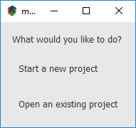
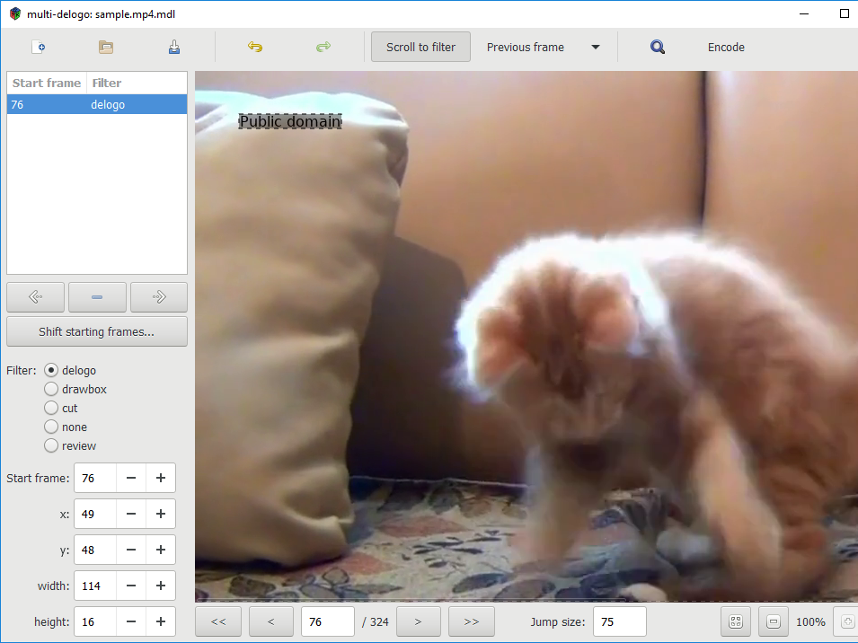
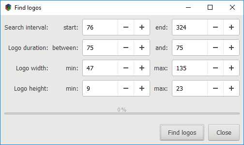

# Using multi-delogo

This document will describe how to use multi-delogo to remove logos from videos.

We'll use a sample video, distributed with multi-delogo: [sample.mp4](../sample.mp4). This video shows and adorable kitten playing, but unfortunately it has some text added to it. Moreover, the text changes place several times during the video:

multi-delogo allows you to mark all the occurrences of the text, and generate a video removing the texts.

## Starting

When you run the program, you'll see a window with two options:

* **Start a new project** starts a new project from a video file.
* **Open an existing project** allows you to continue a project you've already started.

Download the [sample video](../sample.mp4) if you haven't already, run multi-delogo and select **Start a new project**. Select the `sample.mp4` file.

## Navigating frames

This is the main window:

It displays one frame of the video at a time.

To navigate a single frame backward or forward, use the < and > buttons, or press **s** or **d**, respectively.

To move a larger number of frames backward or forward, use the << and >> buttons, or the **a** and **d** keys, respectively. These buttons move by the number of frames specified in the **Jump size**, and you can change the jump size as needed.

You can also go directly to a frame by entering its number and pressing Enter.

## Defining a filter manually

In the example video, the text is not displayed in the first frames. We'll have to navigate to the first frame in which the text appears.

In a real case, you'd need to move forward the frames until the text is displayed, using the jump feature to avoid moving frames one by one.

In our example, the first frame with the text is frame 76. So move to frame 76.

Now click near the top left corner of the text, and drag the mouse, drawing a rectangle marking the are with the text:

Now look at the left side of the window. Notice that there is a row in the list saying **76 - delogo**. That is a _filter_.

A _filter_ is a modification done to the video, in order to remove the logos. The following filters are available:

* _delogo_ attempts to remove a logo in the marked region. It almost always successfully removes the logo, but depending on the background might leave an artifact in the region, as if a blurring filter were applied. For more details, see [the ffmpeg documentation](https://ffmpeg.org/ffmpeg-filters.html#delogo).

* _drawbox_ draws a black blox over the marked region. For more details, see [the ffmpeg documentation](https://ffmpeg.org/ffmpeg-filters.html#drawbox).

* _cut_ removes the part of the video starting at its start frame up to the start of the next filter. Note that if this filter is used, the audio will need to be reencoded as well.

* _none_ is used to not apply any filter to a part of the video.

* _review_ isn't really a filter. It's created by the automatic logo detector (see [Automatically detecting logos](#automatically-detecting-logos)) to indicate parts of the video where the logo couldn't be detected, and that need to be manually reviewed. It's not possible to encode a video while there are review filters. You'll need to change them to another type (manually indicate the logo position, or if there's really no logo, change them to _none_), or remove them before encoding the video.

Filters are applied from their _start frame_ until the start of the next filter, or until the end of the video if it's the last filter.

## Adding more filters

The next step is to move to the frame where the position of the text changes, and add a new filter starting at that frame. That means using the frame navigation buttons until that frame is found.

If the number of frames between logo changes is the same, the jump feature can be helpful: define the jump size to the number of frames each logo is displayed for, and the << and >> buttons will move between the frames where the logo changes. In our sample video, each logo is displayed for 75 frames, so define 75 as the jump size, and click the >> button. You should be at frame 151, and the logo at the top left is not displayed anymore. Instead, a new logo at the top right is now displayed (use the scroll bar or the zoom feature if that part of the image is not visible).

To define the new position for the logo, the process is the same: draw a rectangle covering it. You should end with a result like this:

Note the new filter added to the list, starting at frame 151.

Now just repeat the process, marking each new position for the logo. In our short sample, there are just four positions:

## Automatically detecting logos

All the work done previously might not have been necessary, as in many cases multi-delogo can automatically find logos in your videos and create filters for them.

To use that feature, click the magnifier icon in the toolbar. You'll be presented with a screen like this:

You'll need to define a few parameters:

* *Search interval*: The frame at which to start the search for logos, and the frame at which to stop the search for logos. By default, unless the video is very short, the end point will not be configured to the end of the video (but you can change it to be the last frame if you wish). It is recommended not to run the logo detection for the whole movie at once, but rather to do it in parts. That's because the logo detection is not 100% accurate, so it's preferable to search for logos in a part of the video, review the results, and then run the detection again for the next part.

  In our case, the start frame is 76, as it's the first frame with a logo. Since the video is very short, there's no need to change to end frame.

* *Logo duration*: Here you must specify for how many frames each logo is displayed. In our case, it's 75 in both text boxes, since all logos are displayed for exactly 75 frames. In some videos some logos might be displayed from 100 to 105 frames, so enter those numbers in the text boxes.

* *Logo width* and *Logo height*: Here you must specify the minimum and maximum sizes of the boxes with the logos.

Once the parameters are set, press the *Find logos* button to start the search. This process might take some time, and the status of the search will be reported in the progress bar.

Note that the logo detection is not 100% effective. Some logos will not be able to be detected. When a logo could not be found, a _review_ filter will be inserted to indicate the position where detection failed. You should check the places where this detection failed, and manually add a filter (or set the filter type to _none_ if there is no logo).

Moreover, in a few cases even when a logo is detected, the result might not be correct: the start frame might be off by a few frames, perhaps only part of the logo has been detected, or some other feature of the video was incorrectly considered a logo. Therefore it's recommended to review the results before encoding the video.

### Interrupting and continuing the logo detection

It's possible to stop the logo detection by pressing the *Close* button. The logos already detected will not be lost.

To continue the search, just run the logo detector again, using as *Initial frame* the first frame of a logo after the last one detected.

## Editing filters

The list on the left displays all the filters set for the current project. Selecting a row moves to the start frame of that video, and displays the area in which the video is applied.

To edit an existing filter, you have to be on that filter's start frame. You can move the rectangle by dragging it, and resize it by dragging from the corners and borders. It's also possible to draw another rectangle, replacing the current one. Another possibility is to use the **x**, **y**, **width** and **height** controls below the filter list.

If you are not at a filter's start frame and make any change to the filter, a new filter is added.

To remove a filter, select it and press the button with the minus sign below the filter list.

To move quickly between filters, use the arrows below the filter list.

If **Scroll to filter** on the toolbar is checked, when moving to a filter the frame will be scrolled if necessary so that its rectangle is displayed. If unchecked, no scrolling is performed.

## Encoding the video

Once all the filters are set up, it's time to generate a new video with the logos removed.

To do that, click the **Encode** button. A new window will be opened:

First, select the output file by using the **Select** button or typing a location.

### Format and quality

The options in **Video format** and **Quality** define the video codec to use and the quality of the resulting video.

**If in doubt, you can accept the defaults.** They should generate a high-quality video that is compatible with most players.

Two codecs are supported: H.264 and H.265. H.265 produces smaller files, but encoding is slower, and not all players support it. H.264 is more compatible and faster, but the files are larger.

For both codecs, CRF mode is used. The **Quality** number defines the video quality: in general, lower numbers generate better looking videos, but the file sizes are larger. If in doubt, use the defaults. For more details, see https://trac.ffmpeg.org/wiki/Encode/H.264#crf and https://trac.ffmpeg.org/wiki/Encode/H.265 .

### Changing filter duration

If you check **Randomnly increase filter times**, the duration of each filter will be randomly increased, making it start earlier and/or finish later. The original portion of the video will always be included.

The **Factor** field controls how much each duration is increased. If set to **2**, then each filter will last on average twice its original duration.

### Running the encoder

To do the actual encoding, press the **Encode** button. This will start FFmpeg to encode the video, applying the filters. Encoding may take a long time and cannot be interrupted.

FFmpeg is included in the Windows download, but for Linux you'll have to install it. Your distribution probably includes a package for it.

In Windows, a black console window appears while the video is being encoded. This is normal, that window is FFmpeg being run. Don't close that window, or encoding will stop.

### Running FFmpeg manually

If you want more control over the encoding process, you can run FFmpeg manually. To do that, instead of **Encode**, use **Generate filter script**. This generates a file with the description of the filters to apply, that can be passed to FFmpeg with the `-filter_complex_script` option.
