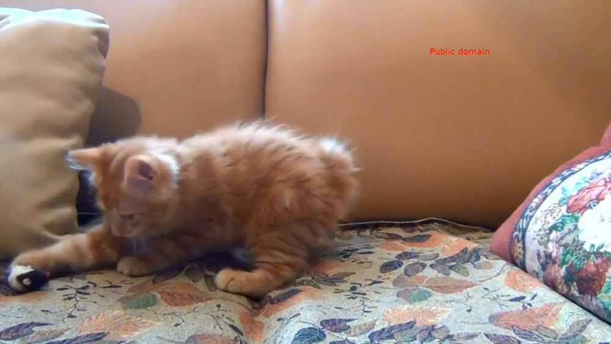
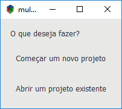
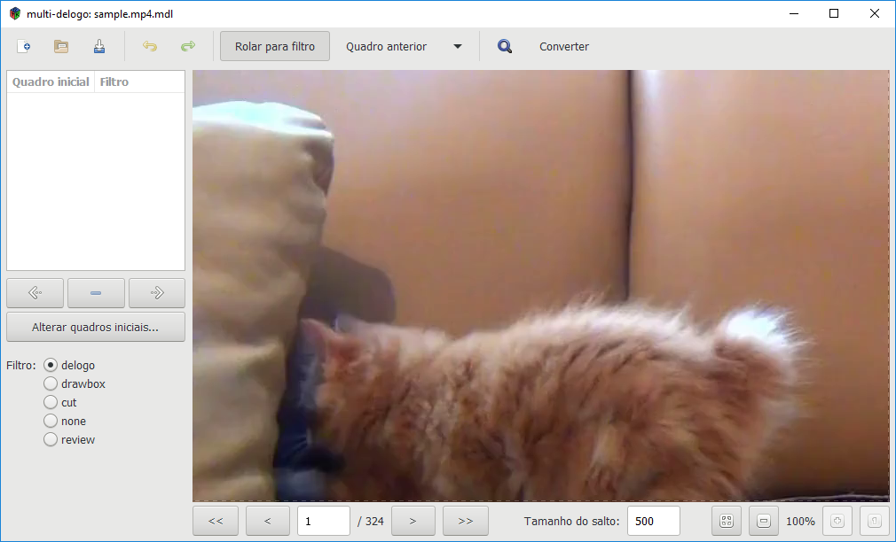
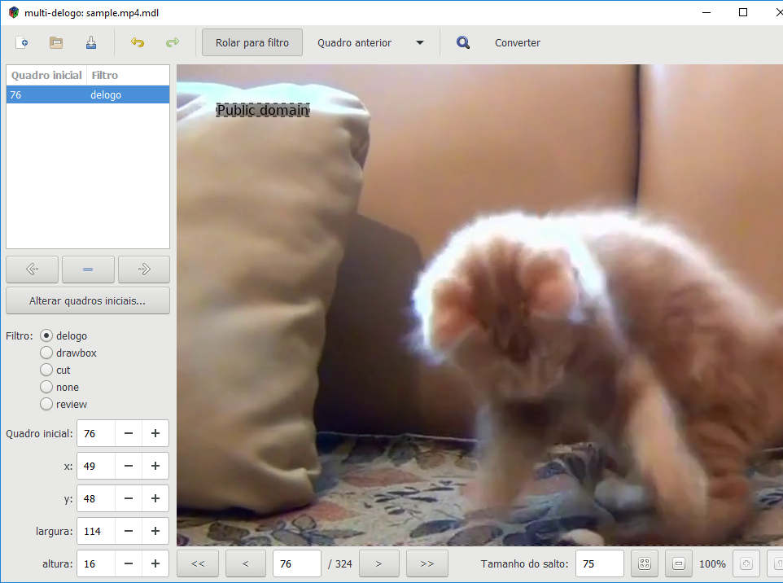
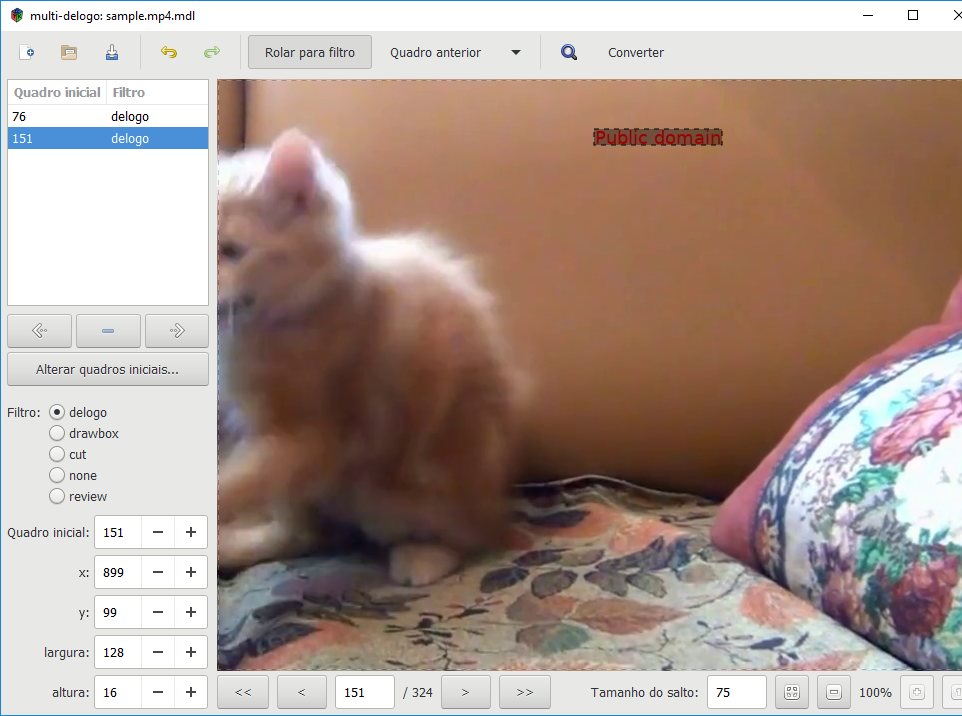
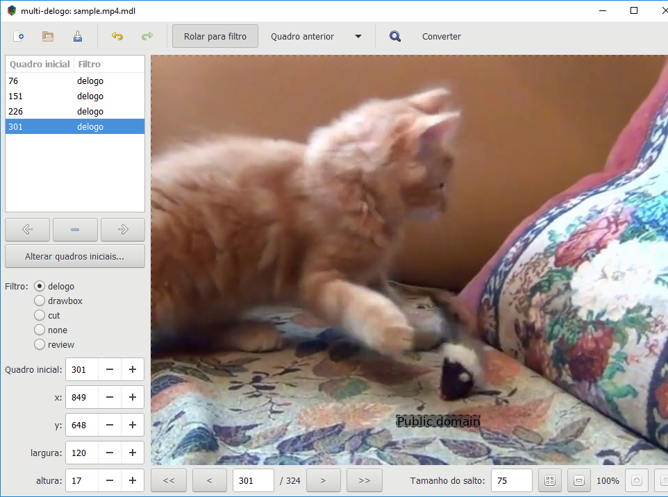
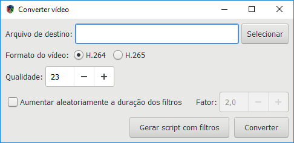

# Usando o multi-delogo

Este documento vai descrever como usar o multi-delogo para remover logos de vídeos.

Usaremos um vídeo de exemplo, distribuído com o multi-delogo: [sample.mp4](../sample.mp4). Este vídeo mostra um gatinho brincando, mas infelizmente tem texto no vídeo. Além disso, o texto muda de posição várias vezes durante o vídeo:

multi-delogo lhe permite marcar todos os lugares onde o texto aparece, e gerar um vídeo sem os textos.

## Iniciando

Ao executar o programa, você verá uma janela com duas opções:

* **Começar um novo projeto** começa um projeto de um arquivo de vídeo.
* **Abrir um projeto existente** lhe permite continuar um projeto já iniciado.

Baixe o [vídeo de exemplo](../sample.mp4) se ainda não o fez, execute o multi-delogo e selecione **Começar um novo projeto**. Selecione o arquivo `sample.mp4`.

## Navegando entre quadros

Esta é a janela principal:

Ela exibe um quadro do vídeo de cada vez.

Para navegar um único quadro para trás ou para frente, use os botões < e >, ou aperte **s** e **d**, respectivamente.

Para saltar um número maior de quadros para trás ou para frente, use os botões << e >>, ou aperte **a** e **d**, respectivamente. Estes botões saltam o número de quadros especificado em **Tamanho do salto**, e você pode alterar o número de quadros conforme a necessidade.

Você também pode ir diretamente para um quadro digitando o número dele e apertando Enter.

## Definindo um filtro

No vídeo de exemplo, o texto não é exibido nos quadros iniciais. Temos que navegar até o primeiro quadro em que o texto aparece.

Num caso real, você terá que avançar os quadros até que o texto apareça, usando os saltos para não ter que mover quadro a quadro.

No nosso exemplo, o primeiro quadro com texto é o 76. Mova então para este quadro.

Agora clique próximo ao canto superior esquerdo do texto, e arreste o mouse, desenhando um retângulo demarcando a área com o texto:

Observe agora o lado esquerdo da janela. Observe que há uma linha na lista dizendo **76 - delogo**. Isto é um _filtro_.

Um _filtro_ é uma modificação feita no vídeo, com o objetivo de remover os logos. Os seguintes filtros são disponíveis:

* _delogo_ tenta remover um logo na região marcada. Ele quase sempre funciona e remove o logo, mas dependendo do fundo pode deixar um artefato na região, como se um filtro de desfoque fosse aplicado. Para mais detalhes, veja [a documentação do ffmpeg](https://ffmpeg.org/ffmpeg-filters.html#delogo).

* _drawbox_ desenha um retângulo preto sobre a região marcada. Para mais detalhes, veja [a documentação do ffmpeg](https://ffmpeg.org/ffmpeg-filters.html#drawbox).

* _cut_ remove a parte do vídeo iniciando no quadro inicial do filtro até o início do próximo filtro. Se esse filtro for usado, o áudio terá que ser recodificado.

* _none_ é usado para não aplicar um filtro a uma parte do vídeo.

* _review_ não é um verdadeiro filtro. Ele é criado pelo detector automático de logos para indicar partes do vídeo em que o logo não pode ser detectado, e que precisam ser revisadas manualmente. Não é possível converter o vídeo enquanto houver filtros review. Você terá que mudá-los para outro tipo (indicando manualmente a posição do logo, ou se não há logo, mudar para _none_, ou removê-los antes da conversão.

Filtros são aplicados do seu _quadro inicial_ até o início do próximo filtro, ou até o fim do vídeo se ele for o último filtro.

## Adicionando mais filtros

O próximo passo é mover para o quadro onde a posição do texto muda, e adicionar um novo filtro iniciando naquele quadro. Isso significa usar os botões de navegação até o quadro em questão ser encontrado.

Se o número de quadros entre a mudança do logo é o mesmo, a função salto pode ser útil: defina o tamanho do salto com o número de quadros em que cada logotipo é exibido, e os botões << e >> moverão entre os quadros em que o logo muda. No nosso vídeo de exemplo, cada logo é exibido por 75 quadros, então defina o tamanho do salto com 75, e clique no botão >>. Você deverá estar no quadro 151, e o logo no canto superior esquerdo não é mais exibido. Ao invés disso, um novo logo no canto superior direito é agora mostrado (use as barras de rolagem ou a função zoom se aquela parte da imagem não for visível).

Para definir a nova posição do logo, o procedimento é o mesmo: desenhe um retângulo cobrindo-o. O resultado deve ser algo como:

Observe o novo filtro adicionado, iniciando no quadro 151.

Agora apenas repita o processo, marcando cada nova posição do logo. Em nosso curto exemplo, há apenas quatro posições:

## Editando filtros

A lista à esquerda mostra todos os filtros definidos para o projeto atual. Selecionar uma linha exibe o quadro inicial daquele filtro, bem como a área em que ele é aplicado.

Para editar um filtro existente, você deverá estar no quadro inicial daquele filtro. Você pode mover o retângulo arrastando-o, ou redimensioná-lo arrastando-o pelos cantos ou bordas. Também é possível desenhar um novo retângulo, substituindo o atual. Outra possibilidade é usar os controles **x**, **y**, **largura** e **altura** abaixo da lista de filtros.

Se você não estiver no quadro inicial e fizer alguma alteração, um novo filtro é adicionado.

Para remover um filtro, selecione-o e aperte o botão com o sinal de menos abaixo da lista de filtros.

Para mover rapidamente entre filtros, use as setas abaixo da lista de filtros.

Se **Rolar para filtro** na barra de ferramentas estiver marcado, ao mover entre filtros o quadro será rolado se necessário para que o retângulo do filtro seja exibido. Se desmarcado, a rolagem não será feita.

## Convertendo o vídeo

Depois que todos os filtros forem definidos, é hora de gerar um novo vídeo sem os logos.

Para fazer isso, clique no botão **Converter**. Uma nova janela será aberta:

Primeiramente, selecione o arquivo de saída usando o botão **Selecionar** ou digitando um caminho.

### Formato e qualidade

As opções **Formato do vídeo** e **Qualidade** definem o codec a utilizar e a qualidade do vídeo gerado.

**Em caso de dúvidas, você pode usar os padrões.** Eles devem gerar um vídeo de alta qualidade compatível com a maioria dos players.

Dois codecs são suportados. H.264 e H.265. H.265 gera arquivos menores, mas a conversão é mais demorada, e nem todos os players suportam esse formato. H.264 é mais compatível e mais rápido, mas os arquivos são maiores.

Para ambos os codecs, o modo CRF é utilizado. O número em **Qualidade** determina a qualidade: em geral, números menores produzem vídeos com mais qualidade, mas os arquivos são maiores. Em caso de dúvida, use os padrões. Para mais detalhes, veja  https://trac.ffmpeg.org/wiki/Encode/H.264#crf e https://trac.ffmpeg.org/wiki/Encode/H.265 .

### Alterando a duração dos filtros

Se **Aumentar duranção dos filtros aleatoriamente** estiver marcado, a duração de cada filtro será aumentada aleatoriamente, fazendo com que eles iniciem antes e/ou terminem depois. A parte originalmente marcada será sempre incluída.

O campo **Fator** controla quanto cada duração é aumentada. Se tem o valor **2**, então cada filtro durará, em média, o dobro do tempo original.

### Executando o conversor

Para fazer a conversão, aperte o botão **Converter**. Isso iniciará o FFmpeg para converter o vídeo, aplicando os filtros. A conversão pode demorar um longo tempo e não pode ser interrompida.

O FFmpeg é incluído no download para Windows, mas no Linux você terá que instalá-lo. Sua distribuição provavelmente tem um pacote com ele.

No Windows, uma janela preta de console aparece enquanto o vídeo é gerado. Isso é normal, a janela é o FFmpeg sendo executado. Não feche a janela, ou a geração do vídeo será interrompida.

### Executando o FFmpeg manualmente

Se você quiser mais controle sobre o processo de conversão, você pode rodar o FFmpeg manualmente. Para fazer isso, ao invés de **Converter**, use **Gerar script com filtros**. Isso gera um arquivo com a descrição dos filtros a aplicar, que pode ser passado para o FFmpeg com a opção `-filter_complex_script`.
